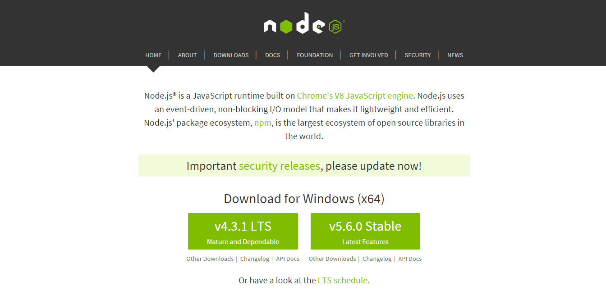
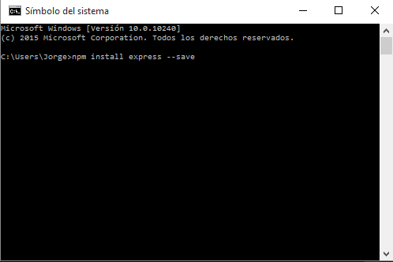
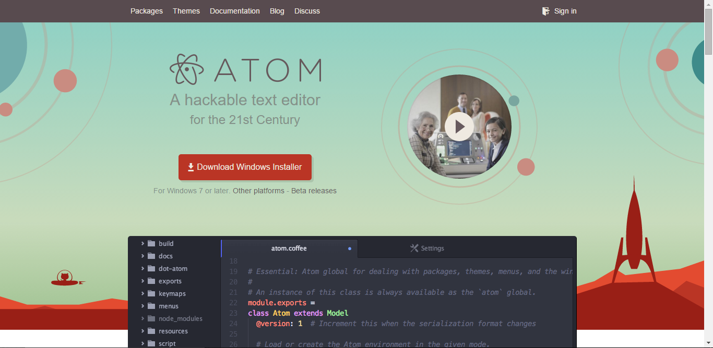
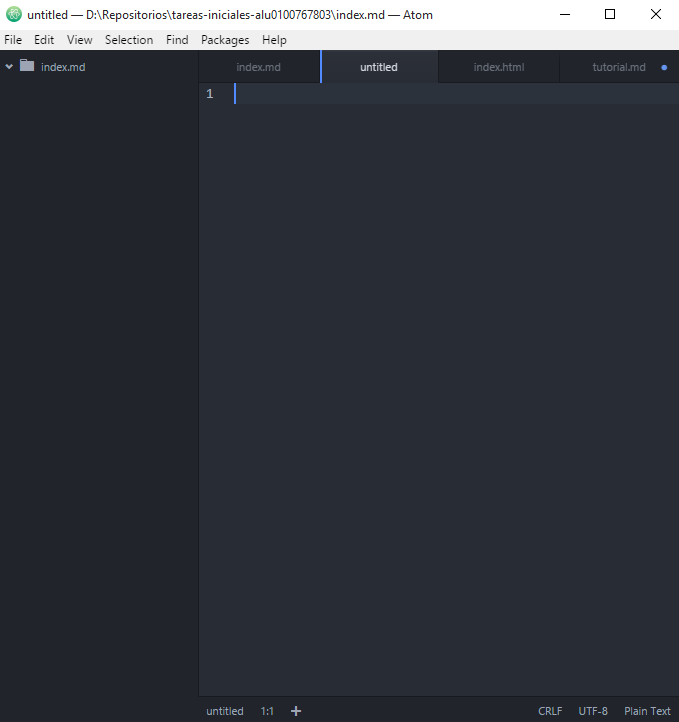
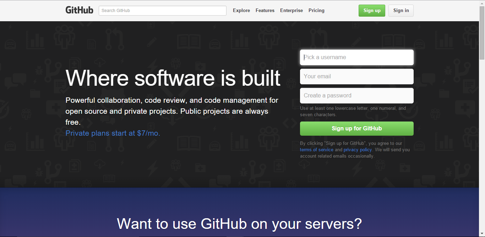
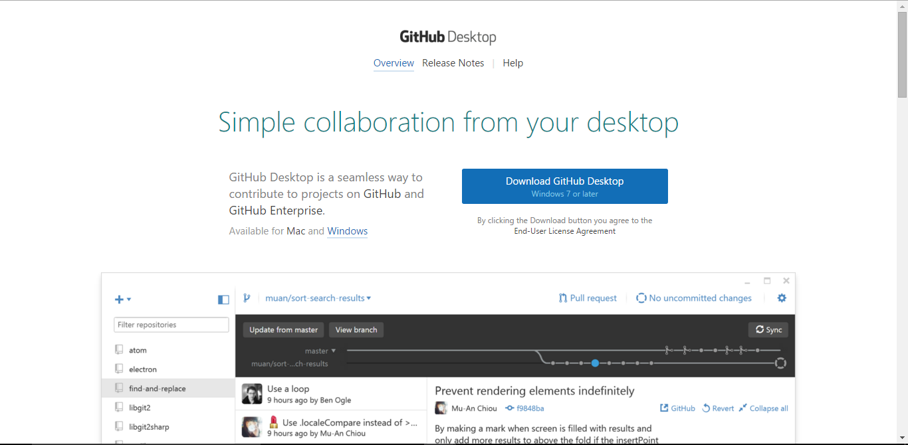
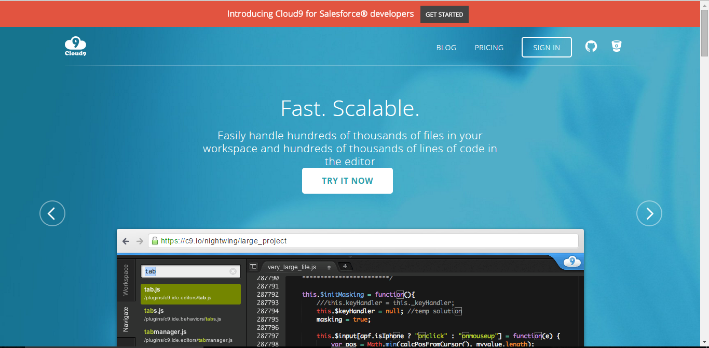
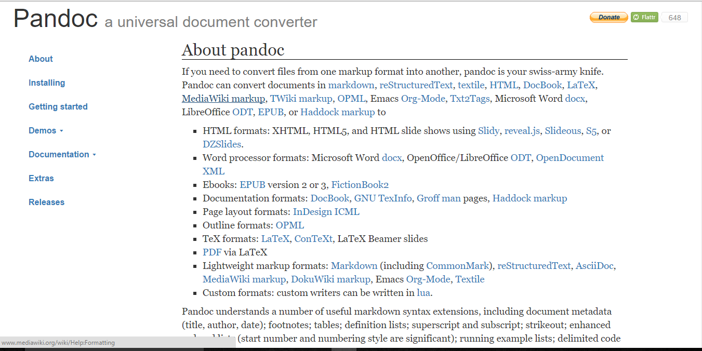

#Tutorial Node.js, Express, Atom, Github y Cloud9

##NodeJS

Para instalar NodeJS en Windows primero debemos descargarnoslo de la web (https://nodejs.org/en/) y seguir los pasos indicados por el instalador

##Express
Para instalar express debemos acceder a una consola en este caso al estar utilizando windows debemos acceder a Símbolo del Sistema y escribir: "npm  install express --save"

##Atom

Para instalar el editor Atom debemos descarlargo de la web (https://atom.io/) y al igual que con NodeJS debemos seguir los pasos del instalador de windows

Al abrir el editor nos debe aparecer un aventana como esta:

##GitHub
Lo primero que debemos hacer es acceder a la pagina de GitHub(https://github.com/) y darnos de alta en la web

Si nuestro entorno de trabajo es windows podremos descargarnos GitHub Desktop (https://desktop.github.com/) y seguir los pasos del instalador.

##Cloud9
Lo ultimo que debemos hacer es ir a la página de cloud9 (https://c9.io/) y darnos de alta

##Pandoc
Pandoc es una herramientsa que ns servirá para traducir ficheros markdown a html u otros formatos, para descargarlo debemos acceder a la web de pandoc(http://pandoc.org/) y descargar el instalador para nuestro sistema operativo y una vez descargado si estamos en windows debemos seguir los pasos del instalador

Para poner en funcionamiento pandoc debemos acceder a una consola y ejecutar el siguiente comando: "pandoc tutorial.md -f markdown -t html -s -o index.html"

